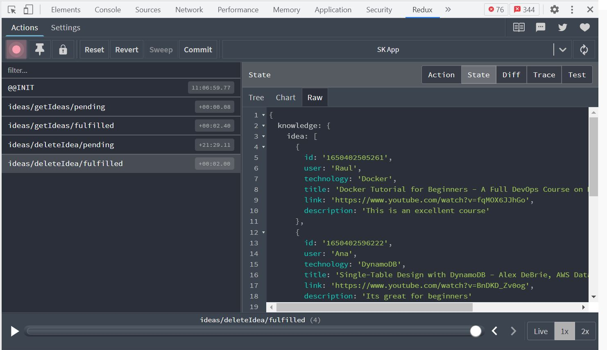

# Sharing Knowledge App

Sharing Knowledge App uses Redux Toolkit to store data in only one place so can every component or element can have access to it.

I am going to share these two links that explain how does Redux Toolkit works and helps me a lot to understand:

- [Redux Toolkit Better way to write Redux code in ReactJS](https://www.geeksforgeeks.org/redux-toolkit-better-way-to-write-redux-code-in-reactjs/#:~:text=Redux%20Toolkit%20is%20used%20for,the%20data%20in%20the%20reducer.)

- [Promises with Redux Toolkit](https://redux-toolkit.js.org/api/createAsyncThunk)

Everyone is wondering how we can see what is happening in the state or what changes the state is going through. Well, the answer is Redux DevTools Extension.

# Redux DevTools Extension

Developer Tools to power-up Redux development workflow or any other architecture which handles the state change.

It can be used as a browser extension (for Chrome, Edge and Firefox), as a standalone app or as a React component integrated in the client app.

This tool allows us to see the state of each activity that occurs. You can see the form of a tree, chart, and raw. Choose the one that helps you visualize better, as you can see in the images.

# Installation

### 1.For Chrome

- from [Chrome Web Store](https://chrome.google.com/webstore/detail/redux-devtools/lmhkpmbekcpmknklioeibfkpmmfibljd)

### 2. With Redux in Visual Studios

- Npm package to install: npm install --save @redux-devtools/extension

[For more information about Redux DevTools](https://github.com/reduxjs/redux-devtools)
